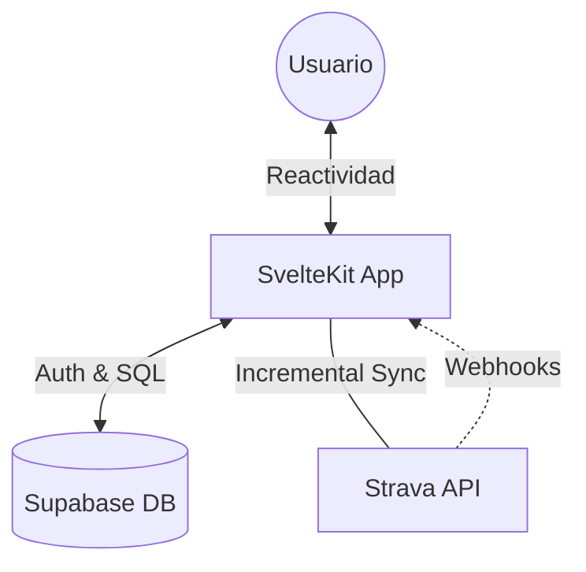

# REFACTOR_PLAN: Strava Analytics Real-Time Dashboard

**Author:** Marina Milo
**Architecture:** SvelteKit + Supabase (Postgres) + Strava REST API

---

## 1. Visión General

Transformar el actual generador de sitio estático en PHP a una **aplicación web dinámica de alto rendimiento** utilizando SvelteKit. El foco principal es la **actualización incremental de datos** y la visualización reactiva, eliminando la dependencia de Docker/Podman para el usuario final (si se deploya en un servicio como Vercel).

---

## 2. Stack Tecnológico

- **Frontend/Backend (BFF):** SvelteKit con Svelte 5 (Runes).
- **Estilos:** Tailwind CSS (Modern aesthetics, dark mode first).
- **Persistencia:** Supabase (Postgres) para actividades y metadatos.
- **Autenticación:** Supabase Auth + Strava OAuth 2.0.
- **Visualización de Mapas:** Mapbox o Leaflet (vía `summary_polyline`).
- **Gráficos:** Chart.js o LayerChart (específico para Svelte).

---

## 3. Arquitectura del Sistema



### Gestión Inteligente de Recursos (Strava API):

Para respetar los **Rate Limits** (15 min / diarios), se implementará un motor de sincronización que:

1.  Consulte en Supabase la fecha de la última actividad registrada.
2.  Use el parámetro `after` en la API de Strava para traer solo lo nuevo.
3.  Almacene el JSON crudo en una columna `raw_data` para evitar re-fetecheos si cambian los requerimientos.

---

## 4. Esquema de Base de Datos (Supabase)

```sql
-- Perfiles con tokens de Strava
CREATE TABLE public.profiles (
  id UUID REFERENCES auth.users ON DELETE CASCADE PRIMARY KEY,
  strava_athlete_id BIGINT UNIQUE,
  access_token TEXT NOT NULL,
  refresh_token TEXT NOT NULL,
  token_expires_at TIMESTAMPTZ NOT NULL,
  last_sync_at TIMESTAMPTZ,
  preferences JSONB DEFAULT '{"theme": "dark", "units": "metric"}'
);

-- Actividades principales
CREATE TABLE public.activities (
  id BIGINT PRIMARY KEY, -- ID original de Strava
  user_id UUID REFERENCES auth.users ON DELETE CASCADE,
  name TEXT NOT NULL,
  distance NUMERIC,
  moving_time INTEGER,
  type TEXT,
  sport_type TEXT,
  start_date TIMESTAMPTZ,
  summary_polyline TEXT,
  average_heartrate NUMERIC,
  max_heartrate NUMERIC,
  calories NUMERIC,
  raw_data JSONB, -- Backup del JSON de la API
  created_at TIMESTAMPTZ DEFAULT now()
);

-- Equipamiento (Gear)
CREATE TABLE public.gear (
  id TEXT PRIMARY KEY,
  user_id UUID REFERENCES auth.users ON DELETE CASCADE,
  name TEXT,
  brand_name TEXT,
  model_name TEXT,
  distance_accumulated NUMERIC,
  is_primary BOOLEAN DEFAULT false
);
```

---

## 5. Roadmap & Fases de Implementación

### Fase 1: Cimientos y Auth (Días 1-2)

- Inicialización de SvelteKit 5.
- Configuración de `supabase-js`.
- Implementación de OAuth de Strava y almacenamiento de tokens.

### Fase 2: Sync Engine & Persistence (Días 3-5)

- Desarrollo del loader de sincronización incremental.
- Lógica de manejo de Rate Limits.
- Migración de la lógica de procesamiento de polilíneas.

### Fase 3: Dashboard Reactivo (Días 6-10)

- Visualización de la lista de actividades con filtros dinámicos.
- Componentes de estadísticas globales (distancia anual, mensual).
- Integración de mapas para rutas individuales.

### Fase 4: Gear & Mantenimiento (Días 11-14)

- Sincronización de equipamiento.
- Alertas de mantenimiento basadas en kilometraje.

---

## 6. Estrategia de Despliegue

- **App:** Vercel o Netlify (Capa gratuita disponible).
- **DB:** Supabase Free Tier.
- **Workflow:** Sincronización disparada por el usuario al entrar al dashboard o vía Webhooks de Strava para actualizaciones invisibles.
